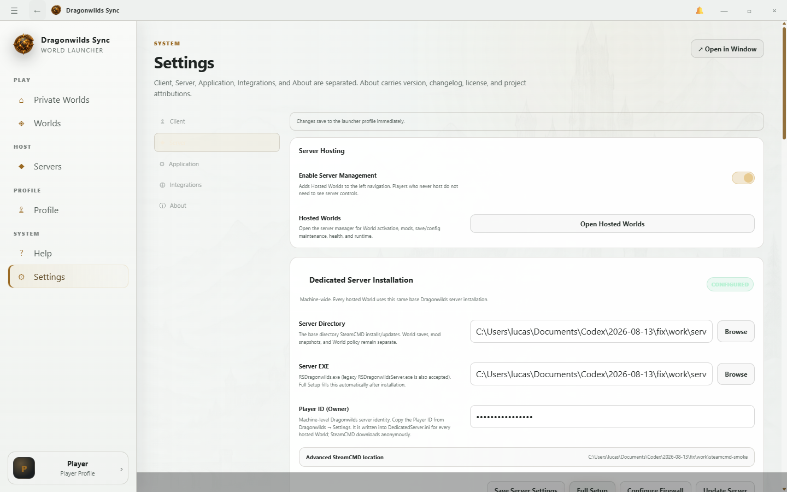
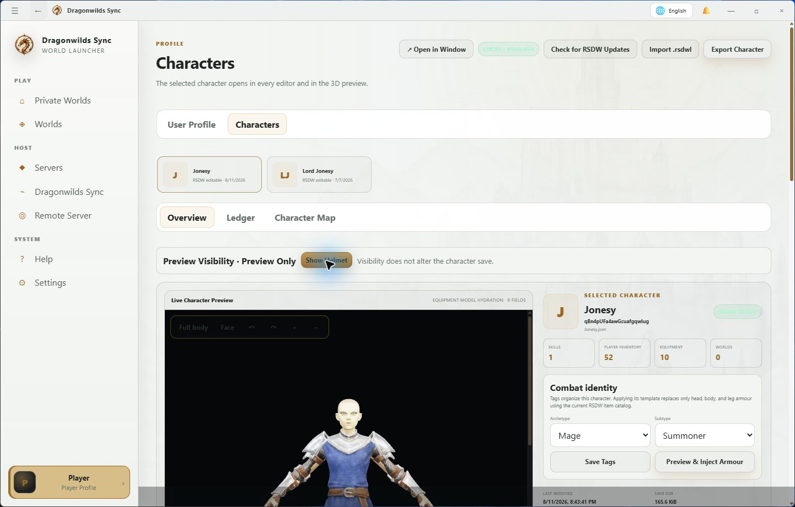
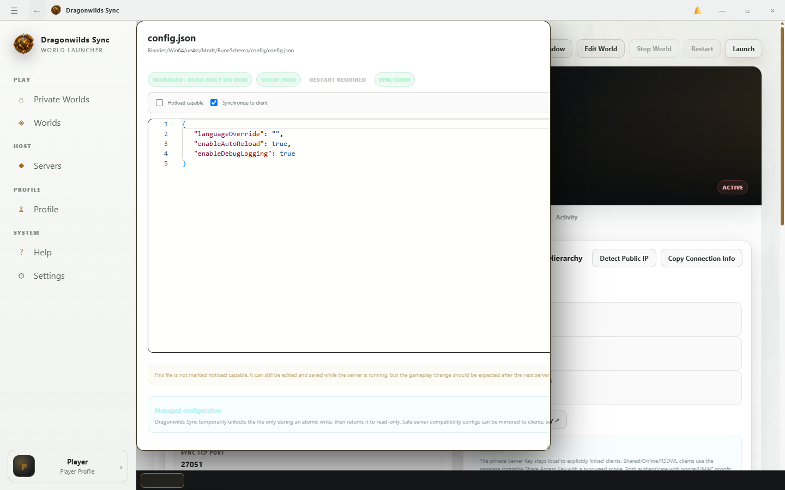
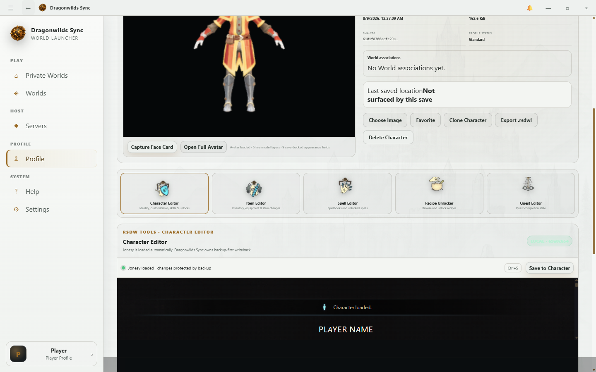
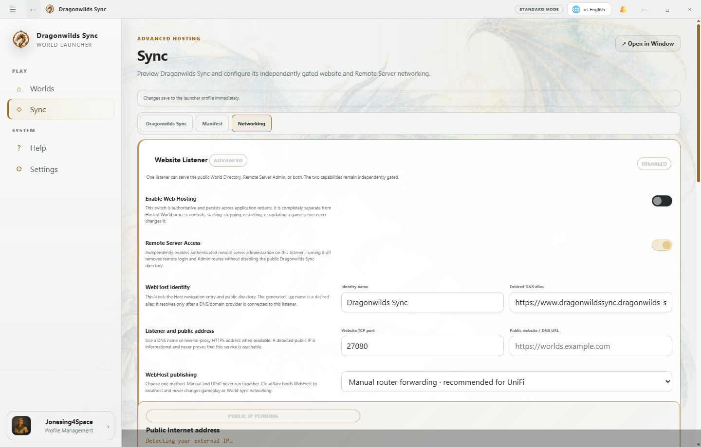

# Appy Walkthrough

Dragonwilds Sync keeps one persistent navigation shell. Moving between Appys preserves the active World context, and each Appy loads only the bounded workspace it owns.

 "Dragonwilds is the single game Appy and retains the Dragonwilds game icon."

## 1. Dragonwilds

- Open **Dragonwilds** for Singleplayer, Co-Op, Dedicated hosting, World profiles, saves, and connections.
- Use **Worlds** for profile placards, **Game Setup** for the local installation, and **Hosting** for dedicated-server setup.
- Launching a World shows one operation banner while Sync, profile activation, and process verification run.

 "Dedicated setup is a tab inside Dragonwilds, not a separate RSDragonwilds navigation item."

## 2. Profile and Characters

- Open the Player chip at the bottom of the navigation bar.
- Review **Associated Character Saves** and their linked or preferred Worlds.
- Choose **Open Character Editor in RSDW-L** to select that exact save and open the guarded Character Editor.

 "The Character workspace shows the selected save and its RSDW-backed editor context."

## 3. Mods

- Open **Mods** for the cross-profile repository and load order.
- Choose **Edit** on a linked profile copy to open its scoped Mod Explorer.
- Text formats such as JSON, JSONC, Lua, INI, CFG, TXT, TOML, YAML, and Markdown are editable; binary payloads remain visible but read-only.
- Save validates JSON when required and performs an atomic write inside the selected mod root.

 "The editor validates supported text formats and cannot write outside the selected managed root."

## 4. RSDW-L

- Open **RSDW-L** for Character, Item, Spell, Recipe, Quest, map, Spawner, and unified-console entry points.
- Save-changing tools create a backup and compare the loaded checksum before writeback.

 "RSDW-L exposes bounded tools while Core retains profile, permission, and runtime authority."

## 5. Sync

- Open **Sync** for the directory, manifests, transfer, Website, and Remote Access surfaces.
- A join verifies the World fingerprint before applying required files.
- The final verification must pass before Dragonwilds launches; a failed or timed-out operation leaves the launcher available for retry.

 "Gameplay UDP, Sync TCP, directory publication, and remote access remain separate and explicit."

## 6. Helpy and Settings

- **Helpy** keeps the current walkthrough and screenshots.
- **Settings** owns application, player, network, update, integration, and system policy.
- Dragonwilds, Characters, Mods, RSDW-L, Sync, Helpy, and Settings each use a packaged image icon rather than a temporary text glyph.
- The titlebar and navigation rail remain mounted while Appys and background status refreshes update the main workspace, so the icons and collapsed state do not disappear or repaint between routes.

> A visible success message is not a substitute for verification. Runtime, save, fingerprint, and atomic-write checks remain authoritative.
