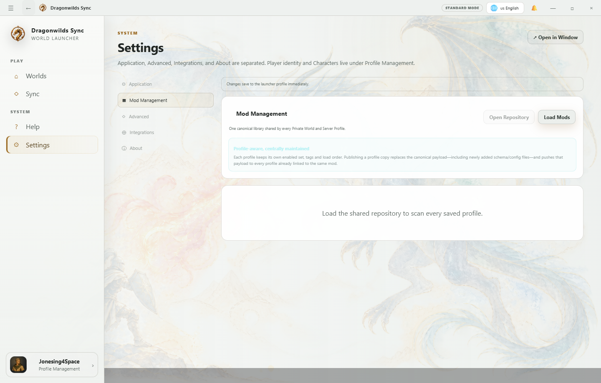

# Mods, Items & Spawner

Dragonwilds Sync keeps mod placement and item metadata profile-aware so a hosted or private World can carry the correct client/server content without turning custom data into global vanilla data.

 "Mods lists linked profile copies and opens the selected copy in a scoped editor."

## Editing a mod

1. Open **Mods** and choose **Edit** on the intended profile copy.
2. Select a user-manageable mod and then a supported text file.
3. Edit JSON, JSONC, Lua, INI, CFG, TXT, TOML, YAML, or Markdown.
4. Save. JSON is parsed first, and every write remains atomic and bounded to the selected mod root.

 "Binary and oversized files are view-only; supported text files expose the Save File action."

## Canonical items

RSDWTools supplies the canonical Dragonwilds item catalog and item artwork. Sync maintains a local cache so Item Editor and Spawner can share the same item identity, display name, icon, category, stack metadata, and source revision.

## Modded Items

Custom or runtime-discovered items belong under **Modded Items**. A definition can include:

- display name;
- in-game/internal summon name;
- PersistenceID / ItemData identity;
- category and equipment slot;
- stack limit and weight metadata;
- description;
- custom or canonical icon.

Server-provided custom definitions are scoped to the World that supplied them rather than leaking into unrelated profiles.

## Spawner

The Spawner should use the same catalog record shown by Item Editor. Review the selected item card and target before issuing a spawn command. Runtime-only item discovery providers may enrich Modded Items when they expose a stable compatibility interface.
