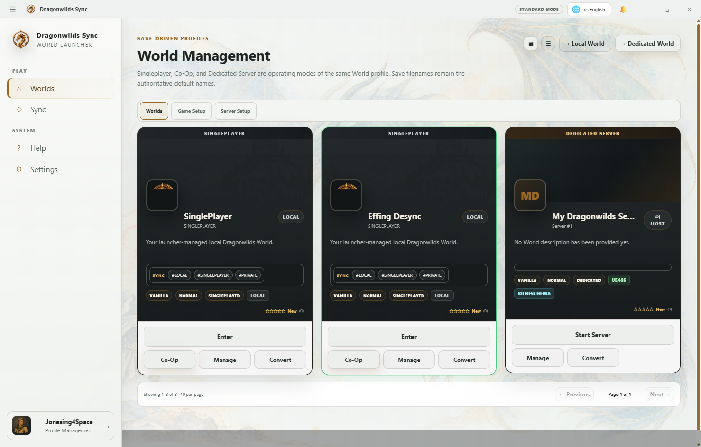

# Worlds & Sync

A **World profile** is the presentation and runtime identity Dragonwilds Sync uses to keep the correct save, mods, configuration, connection information, artwork, and character association together.

 "Singleplayer, Co-Op, Dedicated, and connection roles share one Dragonwilds Appy."

## World views

- **Placard** and **Horizontal** are two presentations of the same World profile. Badges, classification, audience, platform marks, and profile metadata should remain consistent between them.
- **Declared** means the current WebHost is actively receiving a still-live, fingerprint-verified Sync heartbeat from that World.
- **Sync Ready** means the endpoint supports Dragonwilds Sync. It does not necessarily mean that World declared itself to your WebHost.

## Connecting

Sync verifies the World fingerprint when a Sync endpoint is available before treating its richer metadata as authoritative. Passwords and administrative credentials are not part of the public projection.

For **Sync & Play**, the launcher verifies identity, compares only client-required files, applies the minimum safe update, verifies the final manifest, and launches Dragonwilds. Duplicate clicks are rejected while the operation is active, and timeouts return control to the launcher instead of leaving an indefinite loading state.

## Heartbeat projection

A server configured to publish heartbeats to a WebHost appears in **Declared** while its heartbeat remains inside the host TTL and its Sync fingerprint probe succeeds. Stale declarations expire automatically.
